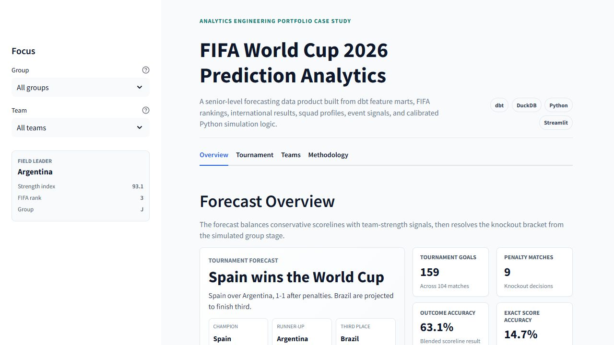

# FIFA World Cup 2026 Prediction Analytics

This project began as a DataCamp competition entry: predict every match in the 2026 FIFA World Cup before the tournament starts. I used it as a chance to build something larger than a notebook submission: a small analytics product with a dbt warehouse layer, Python modeling, tournament simulation, and a dashboard that explains the predictions.

The project combines dbt, DuckDB, and Python to turn raw soccer data into model-ready features, competition outputs, and dashboard-ready datasets.

## What This Project Does

The competition asks for predictions across all 104 World Cup matches, including scorelines, winners, knockout matchups, penalties, corners, yellow cards, and red cards.

Rather than fill those fields manually, this project builds a pipeline around the prediction problem:

1. Standardize the official group fixtures and knockout slots.
2. Add public soccer data such as international results, FIFA rankings, squad information, and event signals for cards and corners.
3. Use dbt to turn raw files into clean staging tables, reusable intermediate models, feature tables, and dashboard marts.
4. Train Python models for goals, outcomes, and scoreline selection.
5. Simulate the group stage and knockout bracket.
6. Export competition-ready prediction files and a dashboard snapshot.

## Why dbt Matters Here

dbt is the backbone of the project. It keeps the data work organized so the model is not trying to join a pile of raw CSVs directly.

The project is split into a few layers:

- **Staging** cleans source files and standardizes names, dates, and types.
- **Intermediate** models build reusable soccer concepts like team-match rows, recent form, and opponent-adjusted features.
- **Marts** expose cleaner tables for team strength, squad profiles, rankings, and cards/corners behavior.
- **Features** produce the training and scoring tables used by the Python model.
- **BI models** reshape the final outputs into dashboard-friendly tables.

The main benefit is traceability. If a forecast changes, there is a path back through the dbt models to understand which source data and transformation logic contributed to it.

## Data Sources

The model uses a mix of competition files and public soccer data:

- DataCamp World Cup group fixtures and knockout slots
- historical international match results
- FIFA men's ranking history
- squad and player profile data where available
- international match-event data for corners and cards
- club player discipline data
- country-level player aggregate features

A key modeling choice is point-in-time feature engineering. Historical training rows only use information that would have been available before each match. That keeps the validation more honest, because the model is not allowed to learn from future rankings or future form.

## Modeling Approach

The prediction layer blends a few ideas rather than relying on one model to do everything:

- Poisson regression estimates home and away expected goals.
- A direct outcome classifier estimates home, draw, and away probabilities.
- A calibrated scoreline selector balances likely exact scores with likely match outcomes.
- Squad strength adjusts the expected-goal view without letting player data overpower team-level signals.
- Corners and cards come from team event profiles built in dbt.
- The knockout bracket is resolved from the predicted group standings, so the tournament output stays internally consistent.

The final scoreline drives the published winner labels. That means a predicted `1-1` group-stage match is always treated as a draw, and a knockout draw is resolved through the model's penalty flag.

## Current Model Results

The latest stable validation metrics are:

| Metric | Result |
| --- | ---: |
| Direct outcome accuracy | 62.8% |
| Blended scoreline outcome accuracy | 63.1% |
| Reconciled exact score accuracy | 14.7% |
| Average goals MAE | 0.907 |

These numbers are realistic for a public-data international soccer model without betting odds. Exact score prediction is especially difficult, so the model is intentionally conservative with scorelines. Common outcomes like `1-0`, `2-0`, and `1-1` appear often because they are both historically common and better aligned with holdout accuracy than a highly variable score generator.

The current deterministic bracket has Spain beating Argentina on penalties in the final, with Brazil finishing third. The simulation layer adds another perspective: across many possible tournament paths, Argentina remains the narrow title-probability favorite even though Spain wins the single deterministic bracket.

## Dashboard Layer

The Streamlit dashboard turns the model output into a project story: who advances, why certain teams are favored, where the bracket gets difficult, and how the model performed against its validation targets.

View the dashboard here:

[world-cup-2026-prediction-analytics.streamlit.app](https://world-cup-2026-prediction-analytics.streamlit.app/)

The hosted app reads committed CSV snapshots from `app/data/`, so it can run publicly without rebuilding the full local DuckDB and dbt pipeline.

## Repository Guide

Useful places to start:

- `dbt_world_cup/models/`: dbt transformations
- `app/streamlit_app.py`: Streamlit dashboard
- `src/train_model.py`: model training and tournament simulation
- `src/export_datacamp_submission.py`: competition export validation
- `src/export_bi_assets.py`: dashboard export generation
- `docs/architecture.md`: system architecture and layer responsibilities
- `docs/dbt_learning_notes.md`: walkthrough of the dbt layers
- `docs/model_training_notes.md`: modeling notes and metrics
- `docs/dashboard_guide.md`: dashboard plan and BI export definitions

Raw source files, the local DuckDB warehouse, and generated intermediate outputs are not committed to the repo. The public repository focuses on the pipeline, transformations, model code, documentation, and dashboard snapshot.
