# Architecture

This project is organized as a small analytics product rather than a single prediction notebook. The important design choice is that every downstream layer consumes a shaped, tested output from the layer before it.

## System Flow

```mermaid
flowchart LR
    raw["Raw source files<br/>Competition fixtures, rankings, results, squads, events"]
    staging["dbt staging<br/>Clean names, dates, types, source-specific quirks"]
    intermediate["dbt intermediate<br/>Reusable match/team concepts and point-in-time joins"]
    marts["dbt marts<br/>Teams, fixtures, rankings, squad strength, event profiles"]
    features["dbt features<br/>Historical training table and 2026 scoring table"]
    python["Python modeling<br/>Goals, outcomes, calibration, bracket simulation"]
    exports["Validated outputs<br/>DataCamp submission and BI extracts"]
    dashboard["Streamlit dashboard<br/>Executive story, bracket, teams, matches, evidence"]

    raw --> staging --> intermediate --> marts --> features --> python --> exports --> dashboard
    marts --> exports
```

## Layer Responsibilities

| Layer | Responsibility | Examples |
| --- | --- | --- |
| Raw | Store source extracts without rewriting history. | DataCamp fixtures, Kaggle international results, FIFA rankings, squad/player tables. |
| Staging | Make each source predictable. | Parse dates, normalize country/team names, preserve raw playoff placeholders. |
| Intermediate | Build reusable analytics concepts. | Team-match rows, rolling form, point-in-time ranking joins, team event profiles. |
| Marts | Publish business-readable tables. | `dim_teams`, `fct_fixture_schedule`, `mart_team_strength`, `mart_latest_fifa_rankings`. |
| Features | Create model-ready inputs. | `features_historical_match_training`, `features_world_cup_group_matches`. |
| Python | Train and reconcile predictions. | Goal model, outcome model, scoreline calibration, knockout simulation. |
| BI | Shape dashboard consumption tables. | `bi_team_profiles`, `bi_match_feature_context`, historical summaries. |
| App | Explain outputs to a stakeholder. | Streamlit executive view, bracket, team lens, match cards, model evidence. |

## Why This Is Analytics Engineering

The project separates transformation, modeling, validation, and presentation. dbt owns repeatable data contracts and SQL lineage. Python owns stateful modeling logic. The dashboard reads a committed BI snapshot so it can be hosted cheaply without giving a public app access to raw source files or a local DuckDB warehouse.

## Trust Boundaries

- Raw CSVs and the local DuckDB warehouse are not committed.
- dbt models are parsed in CI and built locally when raw files are available.
- Python tests cover model helpers, submission validation, and dashboard data contracts.
- Dashboard snapshots in `app/data/` are committed because they are the public presentation artifact.
