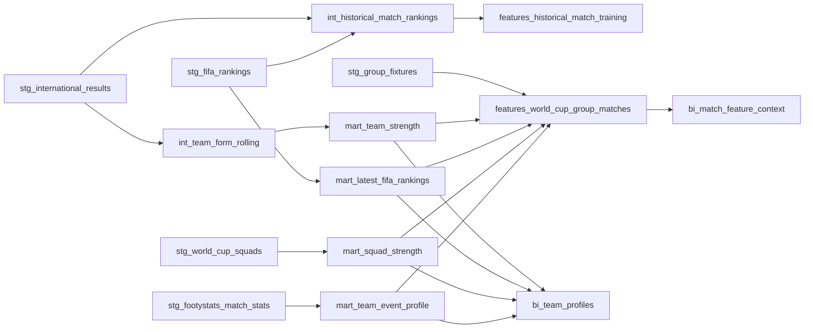

# dbt Docs and Lineage

dbt docs are the best way to show the transformation graph behind the dashboard. The project already includes schema files and tests across staging, intermediate, marts, features, and BI models, so generated docs can explain both lineage and model contracts.

## Generate dbt Docs Locally

dbt docs require the same local raw files and DuckDB profile used by the full pipeline.

```powershell
.\.venv\Scripts\dbt.exe docs generate --project-dir dbt_world_cup --profiles-dir dbt_profiles
.\.venv\Scripts\dbt.exe docs serve --project-dir dbt_world_cup --profiles-dir dbt_profiles
```

The generated site lives under `dbt_world_cup/target/`, which is intentionally ignored by git.

## Lineage To Highlight

The strongest lineage story is:



## What To Screenshot For A Portfolio

Good screenshots for a project page or interview deck:

- the dbt DAG centered on `features_world_cup_group_matches`
- the dbt DAG centered on `bi_team_profiles`
- the model detail page for `features_historical_match_training`, showing point-in-time fields and tests
- the test results page showing row-count, uniqueness, and leakage checks

These screenshots are better than generic code screenshots because they show how the project is governed.
